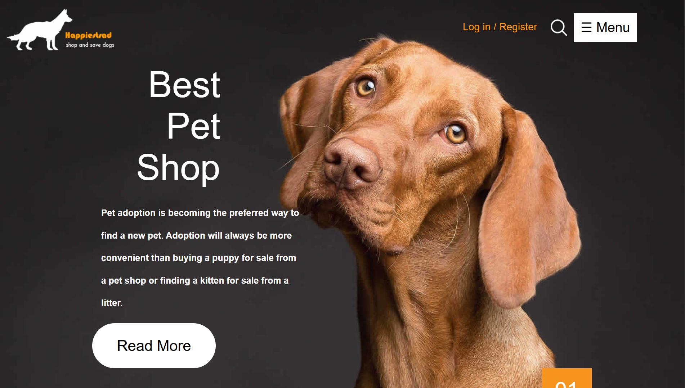
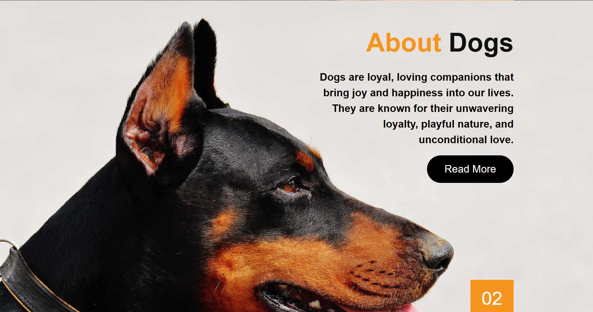
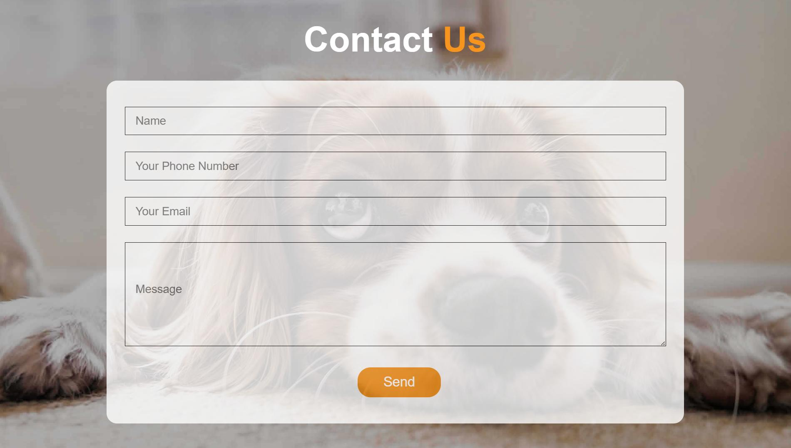
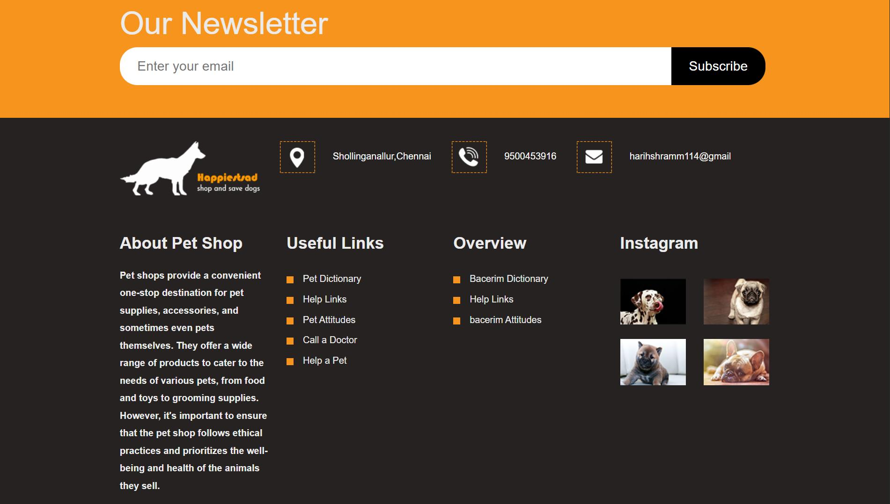

# Pet Adoption Portal

This is a web application that allows users to View and adpot Pets Based on users Preferences.It provides a simple and intuitive user interface, making it easy for users to view Pet.It Lets users to Contact The Pet Store 
## Features

- Users can View Pets
- User-friendly interface for seamless interaction.
- Efficient conversion process with reliable results.
- Lightweight Flask framework for easy deployment and scalability.
- Integration with popular Python libraries for PDF manipulation.
- Error handling and validation for smooth user experience.
- Customizable options for adjusting conversion settings.
## Contributing

If you find any issues or have suggestions for improvements, please feel free to open an issue or submit a pull request. Make sure to follow the project's `code of conduct`.

## Contact
For any inquiries or further information, please contact harihshramm114@gmail.com.

## Screenshots

  
  
  
  

